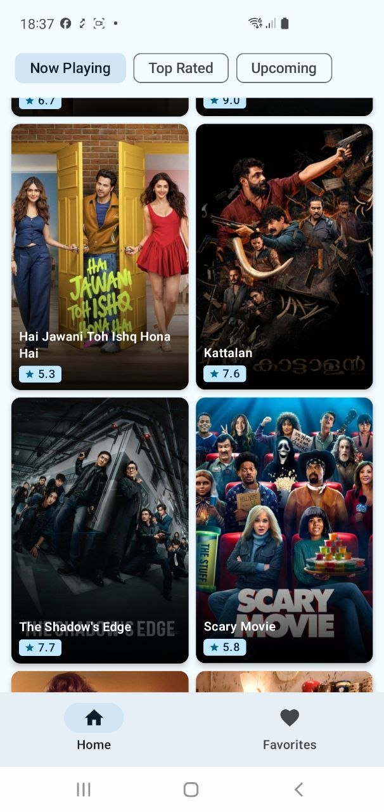
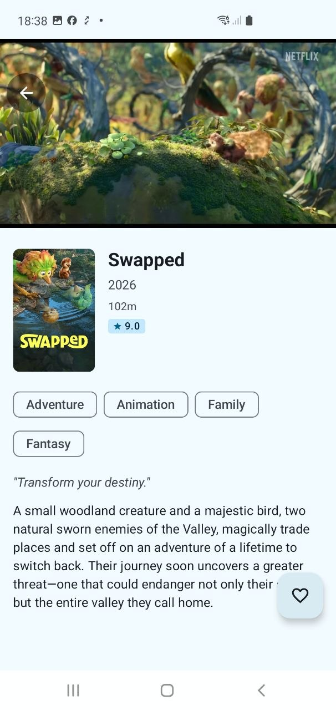
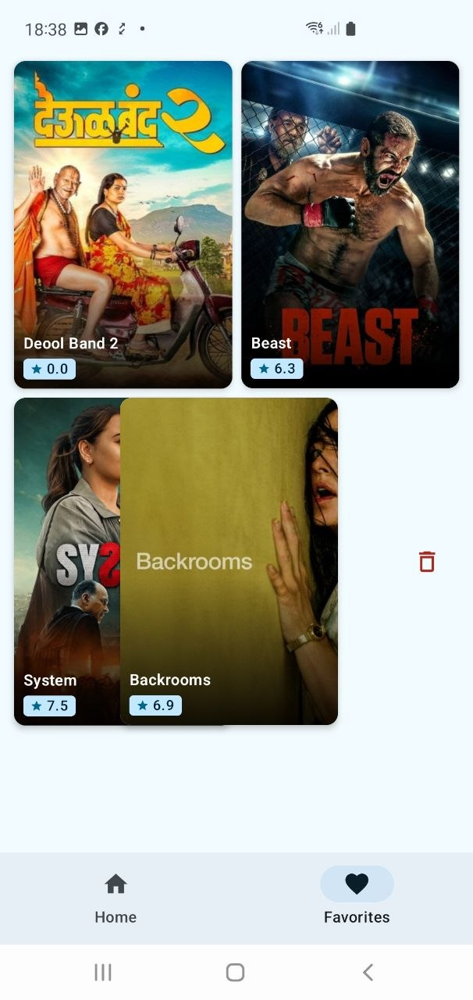
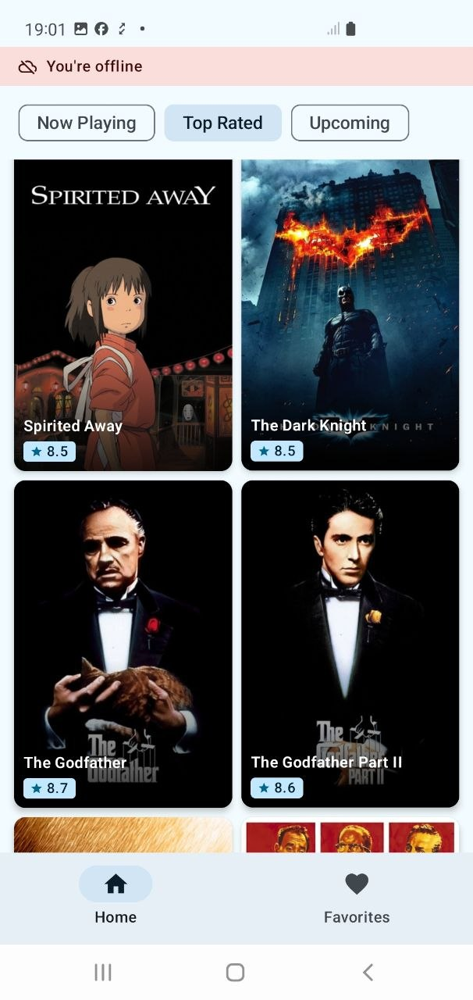

# Movies App

A production-quality Android application that browses movies using [The Movie Database (TMDB) API](https://www.themoviedb.org/documentation/api). Built showcasing Clean Architecture, MVI, Jetpack Compose, Paging 3, typed network error handling, and comprehensive test coverage — including real end-to-end journey tests against the live TMDB API.

---

## Screenshots

<p float="left">
  
  
  
  
</p>

---

## Table of Contents

- [Features](#features)
- [Architecture](#architecture)
- [Tech Stack](#tech-stack)
- [Project Structure](#project-structure)
- [Getting Started](#getting-started)
  - [Optional: TMDB Account Sync](#optional-tmdb-account-sync)
  - [Optional: AI Features (Phase 0+)](#optional-ai-features-phase-0)
- [Caching Strategy](#caching-strategy)
- [Offline Behaviour](#offline-behaviour)
- [Error Handling](#error-handling)
- [Testing](#testing)
- [Limitations](#limitations)

---

## Features

| Feature | Detail |
|---|---|
| **2-tab bottom navigation** | Home (movie grid) + Favorites |
| **Category filter chips** | Now Playing · Top Rated · Upcoming — defaults to Now Playing |
| **Infinite scroll / Paging 3** | 20 items per page, prefetches the next page automatically |
| **Full-bleed poster cards** | 2:3 aspect-ratio cards with gradient scrim, rating badge, and swipe-to-remove on Favorites |
| **Movie detail screen** | YouTube trailer at the top, then metadata: title, year, runtime, rating, genre chips, tagline, overview |
| **Slide navigation animation** | Detail screen slides in from the right; slides back out on back press |
| **Favorites — server sync** | Add/remove favorites syncs to your TMDB account via `POST /account/{id}/favorite` |
| **Favorites — paginated** | Favorites grid is driven by Paging 3; online pages come from TMDB, offline from Room |
| **Favorites — live updates** | Grid refreshes automatically whenever a movie is toggled on **any screen** (detail FAB or favorites swipe) |
| **Swipe to remove favorites** | Swipe a favorites card left to remove; disabled while offline |
| **Offline banner** | Animated banner on both Home and Favorites when connectivity is lost |
| **Image caching — 1-day TTL** | Coil DiskCache (100 MB) + `Cache-Control: max-age=86400`; images served from disk up to 24 hours |
| **Offline image serving** | Images cached on disk are served immediately without any network request |
| **Typed error handling** | `NetworkResult<T>` sealed class; HTTP error messages come from TMDB's `status_message` body; connectivity errors mapped to `ApiError` enum entries |

---

## Architecture

```
UI Layer  (Compose + MVI — State / Intent / Effect)
    ↕
Domain Layer  (repository interface + domain models)
    ↕
Data Layer  (Retrofit + Room + Paging 3 + Coil)
```

### MVI Pattern

Each screen has a `Contract` file defining:
- **State** — immutable snapshot of what the screen should display (collected as `StateFlow`)
- **Intent** — user actions dispatched via `processIntent()`
- **Effect** — one-shot navigation or side-effect events (sent via a `Channel`, where applicable)

### Detail Screen — Sealed UI State

`MovieDetailScreen` uses a **sealed interface** instead of a flat state class:

```kotlin
sealed interface MovieDetailUiState {
    data object Loading : MovieDetailUiState
    data class Error(val message: String) : MovieDetailUiState
    data class Success(val movie: MovieDetail, val trailerKey: String?, val isFavorite: Boolean) : MovieDetailUiState
}
```

The FAB is only rendered inside the `Success` branch — impossible to show during loading or error.

---

## Tech Stack

| Layer | Library / Tool |
|---|---|
| UI | Jetpack Compose + Material 3 |
| State management | MVI (ViewModel + `StateFlow` + `Channel`) |
| DI | Hilt |
| Navigation | Compose Navigation with slide animations |
| Networking | Retrofit 2 + OkHttp 4 + Kotlin Serialization |
| Image loading | Coil 2 with dedicated `OkHttpClient` + `DiskCache` (1-day TTL) |
| Local DB | Room (v1) |
| Paging | Paging 3 (`PagingSource` → `LazyPagingItems`) |
| Video | YouTube Android Player library (embedded WebView) |
| Async | Kotlin Coroutines + Flow |
| Unit testing | JUnit 4 + MockK + Turbine + `paging-testing` |
| UI testing | Compose UI Test (`createComposeRule`) |
| E2E journey tests | Hilt + `@HiltAndroidTest` + `ActivityScenario` against live TMDB API |

---

## Project Structure

```
app/src/main/java/com/tcohen/moviesapp/
├── data/
│   ├── local/              # Room DB (v1), AppDatabase, DAOs (MovieDao, FavoriteDao), entities
│   ├── remote/
│   │   ├── api/            # TmdbApiService, SafeApiCall wrapper
│   │   ├── dto/            # Request/Response DTOs (suffixed *Request / *Response)
│   │   ├── interceptor/    # AuthInterceptor (Bearer token)
│   │   └── paging/         # MoviePagingSource, FavoritesPagingSource, PagingDefaults
│   ├── repository/         # MovieRepositoryImpl
│   └── mapper/             # DTO ↔ Domain ↔ Entity mappers
├── domain/
│   ├── model/              # Movie, MovieDetail, Genre, VideoResult, Category, CategoryExt
│   └── repository/         # MovieRepository interface
├── presentation/
│   ├── home/               # HomeScreen, HomeViewModel, HomeContract
│   ├── moviedetail/        # MovieDetailScreen, MovieDetailContent, MovieMetadata,
│   │                       # MovieDetailViewModel, MovieDetailContract
│   ├── favorites/          # FavoritesScreen, FavoritesComponents, FavoritesViewModel,
│   │                       # FavoritesContract
│   ├── common/             # MovieCard, MovieGrid, MoviePosterImage, CategoryFilterRow,
│   │                       # RatingBadge, TrailerPlayerSection, NetworkErrorFooter,
│   │                       # ErrorView, OfflineBanner
│   ├── navigation/         # AppNavGraph (slide transitions), BottomNavBar, Screen
│   └── theme/              # MoviesAppTheme, Typography
���── di/                     # Hilt modules (NetworkModule, DatabaseModule,
│                           #   RepositoryModule, UtilModule)
└── util/                   # NetworkMonitor, TmdbImageUrl, NetworkResult,
                            # ApiError, NetworkUnavailableException
```

---

## Getting Started

### Prerequisites

- Android Studio Meerkat or later
- Android SDK 26+ (minSdk) / targets SDK 35
- Internet connection (TMDB API calls)

### Clone and Run

```bash
git clone <repo-url>
cd Movies-App
```

> **No setup required.** The TMDB API key and Read Access Token are committed directly in `app/build.gradle.kts` so the app works out of the box. Both are **read-only** credentials scoped to TMDB public data reads.

Open in Android Studio and click **Run** on any device or emulator running API 26+.

### Optional: TMDB Account Sync

To enable server-side favorites sync, fill in the build config fields in `app/build.gradle.kts`:

```kotlin
buildConfigField("String", "TMDB_ACCOUNT_ID", "\"your_account_id\"")
buildConfigField("String", "TMDB_SESSION_ID", "\"your_session_id\"")  // v3 session
```

Without these, favorites are still fully functional — changes are saved locally in Room and a best-effort sync is attempted using the Bearer token.

### Optional: AI Features (Phase 0+)

Phase 0 adds an `LlmClient` powered by Google's Gemini free tier. **Unlike TMDB, the AI credentials are intentionally NOT committed to source** — they're tied to your personal Google account and rate-limited per-key, so publishing them would burn your quota and risk the key being abused. The committed value is an empty placeholder:

```kotlin
// app/build.gradle.kts
buildConfigField("String", "GEMINI_API_KEY", "\"\"")  // ← drop your key here
```

**To exercise the AI features (30 seconds):**

1. Get a free Gemini API key at **https://aistudio.google.com/app/apikey** — sign in with any Google account, click *Create API key*, copy the result.
2. Paste it into the `GEMINI_API_KEY` `buildConfigField` above (between the inner quotes).
3. Sync Gradle and rebuild.

Free-tier limits are generous for personal use: **15 requests/min, ~1M tokens/min, 1,500 requests/day**. See [`docs/LLM_SETUP.md`](docs/LLM_SETUP.md) for the full setup, the
swappable-provider pattern, and the prompt-versioning strategy used by the
response cache.

**Without a key, the app builds and runs identically** — every screen, every test, the existing 188-test green status. Only feature-touching LLM calls fail fast with
`NetworkResult.Error(ApiError.UNAUTHORIZED.message)` and a clear message in the
UI ("Couldn't authenticate with the AI provider — check your API key"). The
TMDB paths, paging flows, favorites sync, image caching, and offline behaviour
all continue to work exactly as before.

---

## Caching Strategy

### Image Caching

Images use a **two-tier cache** with a hard 1-day expiry:

| Tier | Storage | TTL | Purpose |
|---|---|---|---|
| Memory cache | RAM (25% of available) | Process lifetime | Instant display; no I/O for already-seen posters |
| Disk cache (`image_cache/`, 100 MB) | Internal storage | 24 hours | Survives app kills and device restarts |

Coil uses a **dedicated `OkHttpClient`** (separate from Retrofit's API client). A network interceptor stamps every image response with `Cache-Control: max-age=86400`. After 24 hours Coil re-fetches from TMDB's CDN. While within the TTL — including when the device is offline — images are served directly from the Coil `DiskCache`.

### Movie List Caching (Room)

`MoviePagingSource` caches pages in the `movies` Room table:

- **Online (page 1):** old cached rows for the category are **cleared first**, then fresh data is inserted. This prevents stale entries from lingering after TMDB updates its lists.
- **Online (page N > 1):** rows appended to the existing cache.
- **Offline:** pages already in Room are served freely; hitting a page that isn't cached returns `LoadResult.Error(NetworkUnavailableException)`, which Paging 3 renders as an inline `NetworkErrorFooter` — not a full-screen takeover.

### Favorites Caching (Room + Server)

Favorite movies are stored in the `favorites` Room table and synced to the TMDB server:

- **Online:** `FavoritesPagingSource` fetches directly from `GET /account/{id}/favorite/movies` and caches results to Room.
- **Offline:** falls back to `favorites` table ordered by `savedAt DESC` (most recently added first).

---

## Offline Behaviour

| Scenario | Behaviour |
|---|---|
| Scrolling within cached movie pages | Served from Room — no network needed, no error shown |
| Scrolling past cached pages | `NetworkErrorFooter` at the bottom; list above remains scrollable |
| Opening movie detail while offline | Full-screen `ErrorView` with Retry button |
| Trailer when offline | Backdrop image shown — no crash, no error banner |
| Images when offline | Served from Coil DiskCache (if fetched within the last 24 hours) |
| Favorites while offline | Room cache served; swipe-to-remove disabled; offline banner shown |
| Returning online | Paging retries automatically; detail screen shows Retry |

---

## Error Handling

All API calls go through `safeApiCall`, which maps every failure to `NetworkResult<T>`:

```kotlin
sealed class NetworkResult<out T> {
    data class Success<T>(val data: T) : NetworkResult<T>()
    data class Error(val message: String, val httpCode: Int = 0) : NetworkResult<Nothing>()
}
```

- **HTTP errors:** the TMDB error body (`{"status_message": "..."}`) is parsed and its `statusMessage` is used as the user-facing string. If parsing fails, `ApiError.SERVER_ERROR.message` is the fallback.
- **Connectivity errors:** mapped to `ApiError` enum entries (`NO_CONNECTION`, `TIMEOUT`, `UNEXPECTED`), which own their display strings in one place.
- **Paging errors:** `LoadResult.Error(e)` propagates to `LoadState.Error`; the UI renders `NetworkErrorFooter` (inline) or `ErrorView` (full-screen) accordingly.

---

## Testing

### Unit Tests — 101 tests (run on JVM, no device needed)

```bash
./gradlew testDebugUnitTest
```

| Suite | Tests | What's covered |
|---|---|---|
| `HomeViewModelTest` | 9 | Category selection, offline state, network error, paging flow |
| `MovieDetailViewModelTest` | 12 | All UI states (Loading/Success/Error), trailer degradation, favorite toggle, HTTP error codes |
| `FavoritesViewModelTest` | 4 | Offline state, remove favorite, paging flow |
| `MoviePagingSourceTest` | 10 | Online/offline paths, page keys, error cases |
| `FavoritesPagingSourceTest` | 11 | Online/offline paths, offset pagination, next-page detection |
| `MovieRepositoryImplTest` | 13 | `getMovieDetail`, `getTrailer`, `toggleFavorite`, server sync |
| `MovieMapperTest` | 12 | DTO → domain, domain → entity, round-trips |
| `TmdbImageUrlTest` | 9 | `poster()`, `posterLarge()`, `backdrop()` — null and non-null inputs |
| `CategoryExtTest` | 9 | `displayName` for all categories, ordering, uniqueness |
| `ApiErrorTest` | 7 | All enum entries, unique messages, `NetworkResult.Error` round-trip |
| `MainDispatcherRule` | — | Test infrastructure (coroutine dispatcher swap) |

### UI Component Tests — 79 tests (run on device/emulator)

```bash
./gradlew connectedDebugAndroidTest
```

| Suite | What's tested |
|---|---|
| `MovieCardTest` | Title rendering, rating badge, click callback, test tag |
| `CategoryFilterRowTest` | Selected chip highlighting, chip tap callback |
| `RatingBadgeTest` | Score formatting and display |
| `NetworkErrorFooterTest` | Visibility on error, retry callback |
| `MoviePosterImageTest` | Renders with and without URL, content description |
| `ErrorViewTest` | Message display, retry button, callback |
| `OfflineBannerTest` | Shows when offline, hidden when online |
| `TrailerPlayerSectionTest` | Player container shown with key, backdrop shown without |
| `MovieMetadataTest` | Title, year, runtime, genres, tagline, overview, rating |
| `MovieDetailContentTest` | Backdrop/poster nodes, trailer vs. no-trailer paths |
| `FavoritesScreenTest` | Empty state composable isolation |
| `HomeScreenFlowTest` | Category chips, movie grid, card tap callback, offline banner |
| `MovieDetailFlowTest` | Error/retry, success state, Loading → Success transition |
| `FavoritesFlowTest` | Empty state, populated grid, error state, offline banner, state transition |

### End-to-End Journey Tests — 8 tests (run on device against live TMDB API)

```bash
./gradlew connectedDebugAndroidTest
```

`RealAppJourneyTest` launches the full `MainActivity` via Hilt with the **real `MovieRepositoryImpl`**, real Room database, and real TMDB network calls. Uses `@HiltAndroidTest` + a custom `HiltTestRunner`.

| Journey | What's validated |
|---|---|
| `homeScreen_loadsRealMoviesFromTmdb` | Movie cards appear in the grid from a live API response |
| `homeScreen_categoryChips_visible` | All 3 category chips are displayed |
| `homeScreen_tapMovieCard_opensDetailScreen` | Tapping a card navigates to the detail screen |
| `detailScreen_navigateBack_returnsToHome` | Back button returns to the home grid |
| `favoritesTab_showsEmptyState_initially` | Empty heart + "No saved movies yet" shown on first launch |
| `toggleFavorite_movieAppearsInFavoritesTab` | FAB toggle adds a movie; it appears in the Favorites tab |
| `swipeLeft_removesMovieFromFavoritesList` | Swipe-to-dismiss removes a movie from the grid |
| `favoritesTab_showsOnlyFavoritedMovies` | Only movies explicitly favorited appear in the tab |

**Infrastructure:**
- `HiltTestRunner` — custom `AndroidJUnitRunner` that boots `HiltTestApplication`
- `@Before` / `@After` — clears both Room (`db.clearAllTables()`) and the TMDB server favorites (`markFavorite(favorite = false)` for every favorited movie) so tests are fully isolated

---

## Limitations

- Trailer playback requires internet (YouTube player); the trailer section degrades to the backdrop image when offline.
- Movie detail and trailers are always fetched live — they are not cached in Room.
- Favorites server sync (`GET /favorite/movies`) works with the Bearer token. Adding/removing (`POST /account/{id}/favorite`) also uses the Bearer token; pass a `TMDB_SESSION_ID` in `build.gradle.kts` if your account requires v3 session auth.
- Journey tests require a live internet connection and will attempt a best-effort cleanup of server favorites after each test.
