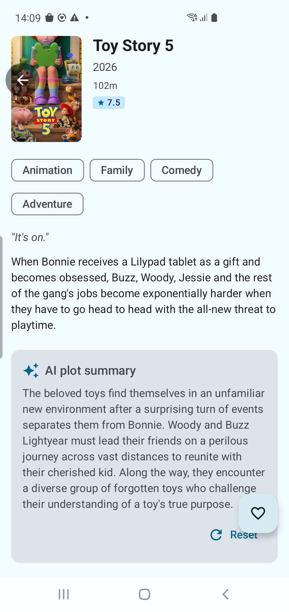

# Movies App

A production-quality Android application that browses movies using [The Movie Database (TMDB) API](https://www.themoviedb.org/documentation/api). Built showcasing Clean Architecture, MVI, Jetpack Compose, Paging 3, typed network error handling, and comprehensive test coverage — including real end-to-end journey tests against the live TMDB API.

Free-text search, "More like this" recs, server-mirror Room cache, debounced query streaming, and AI plot summaries are the headline features.

---

## Screenshots

<p float="left">
  
  
  
  
  
</p>

---

## Table of Contents

- [Features](#features)
- [Search](#search)
- [More Like This](#more-like-this)
- [AI Plot Summary](#ai-plot-summary)
- [Architecture](#architecture)
- [Tech Stack](#tech-stack)
- [Project Structure](#project-structure)
- [Getting Started](#getting-started)
  - [Optional: TMDB Account Sync](#optional-tmdb-account-sync)
  - [Optional: AI Features (Phase 0+)](#optional-ai-features-phase-0)
- [Caching Strategy](#caching-strategy)
- [Offline Behaviour](#offline-behaviour)
- [Error Handling](#error-handling)
- [Testing](#testing)
- [Limitations](#limitations)

---

## Features

| Feature | Detail |
|---|---|
| **3-tab bottom navigation** | Home (movie grid) · Search · Favorites |
| **Free-text search** | Debounced query stream (300 ms), `MIN_QUERY_LENGTH = 2` gate, MRU history chips, no Room cache for queries — see [Search](#search) |
| **Category filter chips** | Now Playing · Top Rated · Upcoming — defaults to Now Playing |
| **Infinite scroll / Paging 3** | 20 items per page, prefetches the next page automatically |
| **Full-bleed poster cards** | 2:3 aspect-ratio cards with gradient scrim, rating badge; swipe-to-remove on Favorites |
| **Movie detail screen** | YouTube trailer at the top, then metadata, AI summary, and a horizontal "More like this" carousel — see [More Like This](#more-like-this) |
| **Slide navigation animation** | Detail screen slides in from the right; slides back out on back press |
| **Favorites — server sync** | Add/remove favorites syncs to your TMDB account via `POST /account/{id}/favorite` |
| **Favorites — paginated** | Favorites grid is driven by Paging 3; online pages come from TMDB, offline from Room |
| **Favorites — live updates** | Grid refreshes automatically whenever a movie is toggled on **any screen** (detail FAB, favorites swipe, or detailed-from-search) |
| **Favorites — Room server-mirror** | `FavoritesPagingSource.loadFromNetwork` writes through to Room so `observeIsFavorite(id)` reflects server truth on a fresh install; closes the detail-screen-fav-state bug |
| **Swipe to remove favorites** | Swipe a favorites card left to remove; disabled while offline |
| **Offline banner** | Animated banner on Home, Search, and Favorites when connectivity is lost |
| **Image caching — 1-day TTL** | Coil DiskCache (100 MB) + `Cache-Control: max-age=86400`; images served from disk up to 24 hours |
| **Offline image serving** | Images cached on disk are served immediately without any network request |
| **Typed error handling** | `NetworkResult<T>` sealed class; HTTP error messages from TMDB's `status_message` body; connectivity errors mapped to `ApiError` enum entries. All API calls go through `SafeApiCaller` — no `isCurrentlyOnline()` pre-checks scattered around repository / paging-source code |
| **AI plot summary** | On the detail screen, generate a short LLM-written plot summary from the movie's overview; cached & rerunnable via Reset — see [AI Plot Summary](#ai-plot-summary) |

---

## Search

The third bottom-nav tab is a free-text movie search. Tapping the Search tab
opens an input-first screen with type-ahead behaviour: every keystroke fires
the underlying Pager through a `debounce(300 ms) → distinctUntilChanged →
flatMapLatest` chain, so a 20-character query only causes one network round-trip
after the user stops typing.

### How it works

- **Threshold gate** — queries below `MIN_QUERY_LENGTH = 2` short-circuit to
  `PagingData.empty()` without hitting TMDB, so single-character queries don't
  pull the index of "any title starting with `a`".
- **Search is online-only** — by design. User-driven, ephemeral, no need to
  churn the category-keyed Room cache. The whole path goes through
  `SafeApiCaller`, so offline surfaces as the friendly "Search requires an
  internet connection. Showing nothing." copy, exactly like every other
  network error in the app.
- **MRU history chips** — when the user taps a result, the typed query is
  added to `SearchHistoryRepository` (in-memory, MRU-ordered, FIFO-capped at
  5). Tapping a chip refills the input; the chip row hides as soon as the
  input has content.
- **`cachedIn(viewModelScope)`** — paging state survives a round-trip into
  the Detail screen, so back-button preserves scroll position.
- **Empty states** — three distinct renders: `SearchPrompt` ("type to
  search …") for fresh entry, `NoMatchesState` ("No matches for "Dune"")
  when the typed query returned 0 rows, and the standard `ErrorView`
  otherwise.

### Architecture in one breath

```
SearchScreen ─ debounced query flow ─► SearchViewModel ─► MovieRepository.searchMovies
                                                              │
                                                              ▼
                                                    Pager (Paging 3)
                                                              │
                                                              ▼
                                                    SearchPagingSource
                                                              │
                                                              ▼
                                                    safeApiCaller  ◄── offline + exception mapping
                                                              │
                                                              ▼
                                                    TmdbApiService.searchMovies
```

### Files

- `data/remote/paging/SearchDefaults.kt` — `MIN_QUERY_LENGTH`, `DEBOUNCE_MS`,
  `HISTORY_LIMIT`.
- `data/remote/paging/SearchPagingSource.kt` — uses `SafeApiCaller` inside
  `load()`; maps `ApiError.NO_CONNECTION` back to `NetworkUnavailableException`
  so `LoadState.Error` renders the right footer copy.
- `data/local/SearchHistoryRepository.kt` — `@Singleton` in-memory MRU with
  `take(HISTORY_LIMIT)` eviction.
- `presentation/search/SearchContract.kt` — `SearchState`,
  `SearchIntent`, `SearchEffect` (the same MVI tri-shape used everywhere else
  in the app).
- `presentation/search/SearchViewModel.kt` — owns `MutableStateFlow<String>`
  query + the `_query.debounce().distinctUntilChanged().flatMapLatest()`
  chain.
- `presentation/search/SearchScreen.kt` — input bar with leading/trailing
  icons, history `LazyRow`, body multiplexing Loading / Error / Empty /
  Has-Results.

---

## More Like This

Below the AI plot-explainer, the Detail screen renders a horizontal
**"More like this"** carousel powered by TMDB's `GET /movie/{id}/similar`
endpoint. Each poster is tappable; the navigation pushes a fresh detail
screen for the tapped movie.

### How it works

- **Lazy, in-place load** — the section inflates inside the Detail screen
  and fires its own load via a `LaunchedEffect(movieId)`. The parent
  `MovieDetailViewModel` is unaware of it (same decoupled pattern as the
  `PlotExplainerSection`).
- **Sealed UI state** — `Idle`, `Loading`, `Success(movies)`, `Empty`,
  `Error(message)`. The Composable does an exhaustive `when (state)` so
  every branch is compiler-checked; nothing is rendered for `Idle` /
  `Empty` (cleanly hides the entire row).
- **Self-contained ViewModel** — `MoreLikeThisViewModel` is `hiltViewModel`'d
  per composition, keyed on `movieId`, so navigating between detail screens
  produces instance-fresh VMs with no stale state.
- **Graceful degradation** — failed fetches render the section header +
  the error message + a `Retry` button inline. Never hijacks the detail
  screen with a full-screen error.
- **Repository returns `NetworkResult<List<Movie>>`** — rounded by
  `SafeApiCaller`, so all four `ApiError` shapes (`NO_CONNECTION`, `TIMEOUT`,
  `SERVER_ERROR`, `UNEXPECTED`) route through the same wrapper used by every
  other endpoint.

### Files

- `presentation/common/SimilarMoviePosterCard.kt` — compact 110 dp wide
  variant of `MovieCard`, title + year under the poster,
  `testTag("similar_movie_card")`.
- `presentation/moviedetail/morelikethis/MoreLikeThisContract.kt` —
  `MoreLikeThisState` (5 sealed cases) + `MoreLikeThisIntent` +
  `MoreLikeThisEffect`.
- `presentation/moviedetail/morelikethis/MoreLikeThisViewModel.kt` —
  `@HiltViewModel` with an `@Inject MovieRepository`; reads the
  `NetworkResult` envelope returned by `repository.getSimilarMovies(id)`.
- `presentation/moviedetail/morelikethis/MoreLikeThisSection.kt` — the
  composable section; renders `Loading`/`Success`/`Error` and hides
  `Idle`/`Empty`.

---

## AI Plot Summary


After opening a movie, the detail screen shows the standard TMDB metadata block
followed by a new **AI plot summary** card. Tapping the card sends the movie's
`title` + `overview` to the configured LLM (`gemini-2.0-flash` by default) with
a `plot-v1`-versioned prompt, and renders a 2–3 sentence rewrite in the same
voice as the original tagline.

### How it works

- **Lazy, on-demand** — the summary is only fetched when you tap the card; it
  does not run on every detail-screen open.
- **Cached** — the response is stored in `LlmResponseCache`, keyed by
  `sha256(prompt_version + model + temperature + max_tokens + messages)`.
  Repeated taps for the same movie hit the cache instead of burning quota.
- **Reset** — the *Reset* button on the card wipes the cached entry and
  triggers a fresh request, useful when you want to verify cache invalidation.
- **Provider-agnostic** — the underlying `LlmClient` is transport-agnostic;
  swap Gemini for Groq / OpenRouter / OpenAI by changing two
  `buildConfigField` values, no Kotlin edits required.
- **Graceful degradation** — without a `GEMINI_API_KEY` in `build.gradle.kts`
  the card shows a friendly *"Couldn't authenticate with the AI provider —
  check your API key"* inline; the rest of the screen and every other feature
  keeps working.

### Enabling the feature

The feature is gated only by the API key. Set:

```kotlin
// app/build.gradle.kts
buildConfigField("String", "GEMINI_API_KEY", "\"AIza…\"")
```

…and re-sync Gradle. Free-tier Gemini is generous (15 req/min, ~1M tokens/min,
1,500 req/day); a full setup guide, the cache-key strategy, and the
swappable-provider pattern live in [`docs/LLM_SETUP.md`](docs/LLM_SETUP.md).

---

## Architecture

```
UI Layer  (Compose + MVI — State / Intent / Effect)
    ↕
Domain Layer  (repository interface + domain models)
    ↕
Data Layer  (Retrofit + Room + Paging 3 + Coil)
```

### MVI Pattern

Each screen has a `Contract` file defining:
- **State** — immutable snapshot of what the screen should display (collected as `StateFlow`)
- **Intent** — user actions dispatched via `processIntent()`
- **Effect** — one-shot navigation or side-effect events (sent via a `Channel`, where applicable)

### Detail Screen — Sealed UI State

`MovieDetailScreen` uses a **sealed interface** instead of a flat state class:

```kotlin
sealed interface MovieDetailUiState {
    data object Loading : MovieDetailUiState
    data class Error(val message: String) : MovieDetailUiState
    data class Success(val movie: MovieDetail, val trailerKey: String?, val isFavorite: Boolean) : MovieDetailUiState
}
```

The FAB is only rendered inside the `Success` branch — impossible to show during loading or error.

---

## Tech Stack

| Layer | Library / Tool |
|---|---|
| UI | Jetpack Compose + Material 3 |
| State management | MVI (ViewModel + `StateFlow` + `Channel`) |
| DI | Hilt |
| Navigation | Compose Navigation with slide animations |
| Networking | Retrofit 2 + OkHttp 4 + Kotlin Serialization |
| Image loading | Coil 2 with dedicated `OkHttpClient` + `DiskCache` (1-day TTL) |
| Local DB | Room (v1) |
| Paging | Paging 3 (`PagingSource` → `LazyPagingItems`) |
| Video | YouTube Android Player library (embedded WebView) |
| Async | Kotlin Coroutines + Flow |
| Unit testing | JUnit 4 + MockK + Turbine + `paging-testing` |
| UI testing | Compose UI Test (`createComposeRule`) |
| E2E journey tests | Hilt + `@HiltAndroidTest` + `ActivityScenario` against live TMDB API |

---

## Project Structure

```
app/src/main/java/com/tcohen/moviesapp/
├── data/
│   ├── local/              # Room DB (v1), AppDatabase, DAOs (MovieDao, FavoriteDao),
│   │                       # entities, SearchHistoryRepository (in-memory MRU)
│   ├── remote/
│   │   ├── api/            # TmdbApiService, SafeApiCaller wrapper
│   │   ├── dto/            # Request/Response DTOs (suffixed *Request / *Response)
│   │   ├── interceptor/    # AuthInterceptor (Bearer token)
│   │   └── paging/         # MoviePagingSource, FavoritesPagingSource,
│   │                       # SearchPagingSource, PagingDefaults, SearchDefaults
│   ├── repository/         # MovieRepositoryImpl
│   └── mapper/             # DTO ↔ Domain ↔ Entity mappers (incl. toFavoriteEntity)
├── domain/
│   ├── model/              # Movie, MovieDetail, Genre, VideoResult, Category, CategoryExt
│   └── repository/         # MovieRepository interface (incl. searchMovies, getSimilarMovies)
├── presentation/
│   ├── home/               # HomeScreen, HomeViewModel, HomeContract
│   ├── search/             # SearchScreen, SearchViewModel, SearchContract
│   ├── moviedetail/        # MovieDetailScreen, MovieDetailContent, MovieMetadata,
│   │                       # MovieDetailViewModel, MovieDetailContract,
│   │                       # morelikethis/ (MoreLikeThisContract, MoreLikeThisViewModel,
│   │                       # MoreLikeThisSection)
│   ├── favorites/          # FavoritesScreen, FavoritesComponents, FavoritesViewModel,
│   │                       # FavoritesContract
│   ├── common/             # MovieCard, MovieGrid, MoviePosterImage, CategoryFilterRow,
│   │                       # RatingBadge, TrailerPlayerSection, NetworkErrorFooter,
│   │                       # ErrorView, OfflineBanner, SimilarMoviePosterCard
│   ├── navigation/         # AppNavGraph (slide transitions), BottomNavBar, Screen
│   └── theme/              # MoviesAppTheme, Typography
���── di/                     # Hilt modules (NetworkModule, DatabaseModule,
│                           #   RepositoryModule, UtilModule, LlmModule)
└── util/                   # NetworkMonitor, TmdbImageUrl, NetworkResult,
                            # ApiError, NetworkUnavailableException
```

---

## Getting Started

### Prerequisites

- Android Studio Meerkat or later
- Android SDK 26+ (minSdk) / targets SDK 35
- Internet connection (TMDB API calls)

### Clone and Run

```bash
git clone <repo-url>
cd Movies-App
```

> **No setup required.** The TMDB API key and Read Access Token are committed directly in `app/build.gradle.kts` so the app works out of the box. Both are **read-only** credentials scoped to TMDB public data reads.

Open in Android Studio and click **Run** on any device or emulator running API 26+.

### Optional: TMDB Account Sync

To enable server-side favorites sync, fill in the build config fields in `app/build.gradle.kts`:

```kotlin
buildConfigField("String", "TMDB_ACCOUNT_ID", "\"your_account_id\"")
buildConfigField("String", "TMDB_SESSION_ID", "\"your_session_id\"")  // v3 session
```

Without these, favorites are still fully functional — changes are saved locally in Room and a best-effort sync is attempted using the Bearer token.

### Optional: AI Features (Phase 0+)

Phase 0 adds an `LlmClient` powered by Google's Gemini free tier. **Unlike TMDB, the AI credentials are intentionally NOT committed to source** — they're tied to your personal Google account and rate-limited per-key, so publishing them would burn your quota and risk the key being abused. The committed value is an empty placeholder:

```kotlin
// app/build.gradle.kts
buildConfigField("String", "GEMINI_API_KEY", "\"\"")  // ← drop your key here
```

**To exercise the AI features (30 seconds):**

1. Get a free Gemini API key at **https://aistudio.google.com/app/apikey** — sign in with any Google account, click *Create API key*, copy the result.
2. Paste it into the `GEMINI_API_KEY` `buildConfigField` above (between the inner quotes).
3. Sync Gradle and rebuild.

Free-tier limits are generous for personal use: **15 requests/min, ~1M tokens/min, 1,500 requests/day**. See [`docs/LLM_SETUP.md`](docs/LLM_SETUP.md) for the full setup, the
swappable-provider pattern, and the prompt-versioning strategy used by the
response cache.

**Without a key, the app builds and runs identically** — every screen, every test, the existing 188-test green status. Only feature-touching LLM calls fail fast with
`NetworkResult.Error(ApiError.UNAUTHORIZED.message)` and a clear message in the
UI ("Couldn't authenticate with the AI provider — check your API key"). The
TMDB paths, paging flows, favorites sync, image caching, and offline behaviour
all continue to work exactly as before.

---

## Caching Strategy

### Image Caching

Images use a **two-tier cache** with a hard 1-day expiry:

| Tier | Storage | TTL | Purpose |
|---|---|---|---|
| Memory cache | RAM (25% of available) | Process lifetime | Instant display; no I/O for already-seen posters |
| Disk cache (`image_cache/`, 100 MB) | Internal storage | 24 hours | Survives app kills and device restarts |

Coil uses a **dedicated `OkHttpClient`** (separate from Retrofit's API client). A network interceptor stamps every image response with `Cache-Control: max-age=86400`. After 24 hours Coil re-fetches from TMDB's CDN. While within the TTL — including when the device is offline — images are served directly from the Coil `DiskCache`.

### Movie List Caching (Room)

`MoviePagingSource` caches pages in the `movies` Room table:

- **Online (page 1):** old cached rows for the category are **cleared first**, then fresh data is inserted. This prevents stale entries from lingering after TMDB updates its lists.
- **Online (page N > 1):** rows appended to the existing cache.
- **Offline:** pages already in Room are served freely; hitting a page that isn't cached returns `LoadResult.Error(NetworkUnavailableException)`, which Paging 3 renders as an inline `NetworkErrorFooter` — not a full-screen takeover.

### Favorites Caching (Room + Server)

Favorite movies are stored in the `favorites` Room table and synced to the TMDB server:

- **Online:** `FavoritesPagingSource` fetches directly from `GET /account/{id}/favorite/movies` and caches results to Room.
- **Offline:** falls back to `favorites` table ordered by `savedAt DESC` (most recently added first).

---

## Offline Behaviour

| Scenario | Behaviour |
|---|---|
| Scrolling within cached movie pages | Served from Room — no network needed, no error shown |
| Scrolling past cached pages | `NetworkErrorFooter` at the bottom; list above remains scrollable |
| Opening movie detail while offline | Full-screen `ErrorView` with Retry button |
| Trailer when offline | Backdrop image shown — no crash, no error banner; courtesy of the `SafeApiCaller`-driven `Success(null)` fast-path in `MovieRepositoryImpl.getTrailer` |
| "More like this" while offline | Section hides itself (header + carousel gone); no error UI — non-blocking by design |
| Search while offline | Friendly "Search requires an internet connection. Showing nothing." `ErrorView`; user can still type and the prompt/chips stay visible |
| Images when offline | Served from Coil DiskCache (if fetched within the last 24 hours) |
| Favorites while offline | Room cache served; swipe-to-remove disabled; offline banner shown |
| Returning online | Paging retries automatically; detail screen shows Retry |
| First-time offline arrival on Favorites | `FavoritesPagingSource.loadFromCache` returns `LoadResult.Error(NetworkUnavailableException)` so the footer copy stays consistent with the rest of the app |

---

## Error Handling

All API calls go through the Hilt-injectable `SafeApiCaller` wrapper
(`data/remote/api/SafeApiCaller.kt`), which owns two responsibilities in one
place — the project no longer scatters duplicate `isCurrentlyOnline()`
pre-checks around the repository or paging sources:

1. **Offline short-circuit.** When the device has no connectivity, the
   wrapper returns `NetworkResult.Error(ApiError.NO_CONNECTION.message)`
   immediately rather than waiting for OkHttp to raise `UnknownHostException`
   / `SocketTimeoutException`. Callers that need bespoke offline behaviour
   (currently only `MovieRepositoryImpl.getTrailer`, which returns
   `Success(null)` so the trailer section degrades to the backdrop image) opt
   out via `bypassOfflineCheck = true`.

2. **Exception → `NetworkResult` mapping.** HTTP errors parse the TMDB
   `status_message` body; connectivity failures map to other `ApiError`
   entries. The mapping table is the single source of truth for "what does
   exception X mean to the user?".

```kotlin
sealed class NetworkResult<out T> {
    data class Success<T>(val data: T) : NetworkResult<T>()
    data class Error(val message: String, val httpCode: Int = 0) : NetworkResult<Nothing>()
}
```

- **HTTP errors:** the TMDB error body (`{"status_message": "..."}`) is parsed and its `statusMessage` is used as the user-facing string. If parsing fails, `ApiError.SERVER_ERROR.message` is the fallback.
- **Connectivity errors:** mapped to `ApiError` enum entries (`NO_CONNECTION`, `TIMEOUT`, `UNEXPECTED`), which own their display strings in one place.
- **Paging errors:** `LoadResult.Error(e)` propagates to `LoadState.Error`; the UI renders `NetworkErrorFooter` (inline) or `ErrorView` (full-screen) accordingly. `SearchPagingSource` translates `ApiError.NO_CONNECTION` back to `NetworkUnavailableException` so the offline footer copy stays consistent.

---

## Testing

### Unit Tests — 153 tests (run on JVM, no device needed)

```bash
./gradlew testDebugUnitTest
```

| Suite | Tests | What's covered |
|---|---|---|
| `HomeViewModelTest` | 9 | Category selection, offline state, network error, paging flow |
| `MovieDetailViewModelTest` | 12 | All UI states (Loading/Success/Error), trailer degradation, favorite toggle, HTTP error codes |
| `FavoritesViewModelTest` | 4 | Offline state, remove favorite, paging flow |
| `MoviePagingSourceTest` | 10 | Online/offline paths, page keys, error cases |
| `FavoritesPagingSourceTest` | 11 | Online/offline paths, offset pagination, next-page detection — incl. the new mid-flight Room write-through |
| `SearchViewModelTest` | 13 | Debounced query flow, `MIN_QUERY_LENGTH` gate, `distinctUntilChanged`, history MRU integration, empty/non-empty threshold, `OpenDetail` effect |
| `SearchPagingSourceTest` | 10 | Online success + page keys, offline → `NetworkUnavailableException` (no API call fired), generic error → `Exception(message)`, `getRefreshKey` cases |
| `SearchHistoryRepositoryTest` | 9 | MRU ordering, case-insensitive dedup, trim, blank-ignored, FIFO cap at `HISTORY_LIMIT`, clear |
| `MovieRepositoryImplTest` | 13 | `getMovieDetail`, `getTrailer`, `toggleFavorite`, server sync, `searchMovies`, `getSimilarMovies` |
| `MoreLikeThisViewModelTest` | 7 | All 5 sealed states reachable (`Idle`/`Loading`/`Success`/`Empty`/`Error`); error-retry transition; `NavigateToDetail` effect |
| `SafeApiCallTest` | 13 | Offline short-circuit (block must NOT run, verified via invocation counter), `bypassOfflineCheck=true` semantics, IOException / SocketTimeout / UnknownHost → typed `ApiError`, HttpException w/ TMDB status_message + 4 fallback variants, cancellation propagates, default `bypassOfflineCheck` is `false` |
| `MovieMapperTest` | 12 | DTO → domain, domain → entity, round-trips |
| `TmdbImageUrlTest` | 9 | `poster()`, `posterLarge()`, `backdrop()` — null and non-null inputs |
| `CategoryExtTest` | 9 | `displayName` for all categories, ordering, uniqueness |
| `ApiErrorTest` | 7 | All enum entries, unique messages, `NetworkResult.Error` round-trip |
| `MainDispatcherRule` | — | Test infrastructure (coroutine dispatcher swap) |

### UI Component Tests — 79 tests (run on device/emulator)

```bash
./gradlew connectedDebugAndroidTest
```

| Suite | What's tested |
|---|---|
| `MovieCardTest` | Title rendering, rating badge, click callback, test tag |
| `CategoryFilterRowTest` | Selected chip highlighting, chip tap callback |
| `RatingBadgeTest` | Score formatting and display |
| `NetworkErrorFooterTest` | Visibility on error, retry callback |
| `MoviePosterImageTest` | Renders with and without URL, content description |
| `ErrorViewTest` | Message display, retry button, callback |
| `OfflineBannerTest` | Shows when offline, hidden when online |
| `TrailerPlayerSectionTest` | Player container shown with key, backdrop shown without |
| `MovieMetadataTest` | Title, year, runtime, genres, tagline, overview, rating |
| `MovieDetailContentTest` | Backdrop/poster nodes, trailer vs. no-trailer paths |
| `FavoritesScreenTest` | Empty state composable isolation |
| `HomeScreenFlowTest` | Category chips, movie grid, card tap callback, offline banner |
| `MovieDetailFlowTest` | Error/retry, success state, Loading → Success transition |
| `FavoritesFlowTest` | Empty state, populated grid, error state, offline banner, state transition |

### End-to-End Journey Tests — 8 tests (run on device against live TMDB API)

```bash
./gradlew connectedDebugAndroidTest
```

`RealAppJourneyTest` launches the full `MainActivity` via Hilt with the **real `MovieRepositoryImpl`**, real Room database, and real TMDB network calls. Uses `@HiltAndroidTest` + a custom `HiltTestRunner`.

| Journey | What's validated |
|---|---|
| `homeScreen_loadsRealMoviesFromTmdb` | Movie cards appear in the grid from a live API response |
| `homeScreen_categoryChips_visible` | All 3 category chips are displayed |
| `homeScreen_tapMovieCard_opensDetailScreen` | Tapping a card navigates to the detail screen |
| `detailScreen_navigateBack_returnsToHome` | Back button returns to the home grid |
| `favoritesTab_showsEmptyState_initially` | Empty heart + "No saved movies yet" shown on first launch |
| `toggleFavorite_movieAppearsInFavoritesTab` | FAB toggle adds a movie; it appears in the Favorites tab |
| `swipeLeft_removesMovieFromFavoritesList` | Swipe-to-dismiss removes a movie from the grid |
| `favoritesTab_showsOnlyFavoritedMovies` | Only movies explicitly favorited appear in the tab |

**Infrastructure:**
- `HiltTestRunner` — custom `AndroidJUnitRunner` that boots `HiltTestApplication`
- `@Before` / `@After` — clears both Room (`db.clearAllTables()`) and the TMDB server favorites (`markFavorite(favorite = false)` for every favorited movie) so tests are fully isolated

---

## Limitations

- Trailer playback requires internet (YouTube player); the trailer section degrades to the backdrop image when offline.
- Movie detail and trailers are always fetched live — they are not cached in Room.
- Favorites server sync (`GET /favorite/movies`) works with the Bearer token. Adding/removing (`POST /account/{id}/favorite`) also uses the Bearer token; pass a `TMDB_SESSION_ID` in `build.gradle.kts` if your account requires v3 session auth.
- Journey tests require a live internet connection and will attempt a best-effort cleanup of server favorites after each test.
